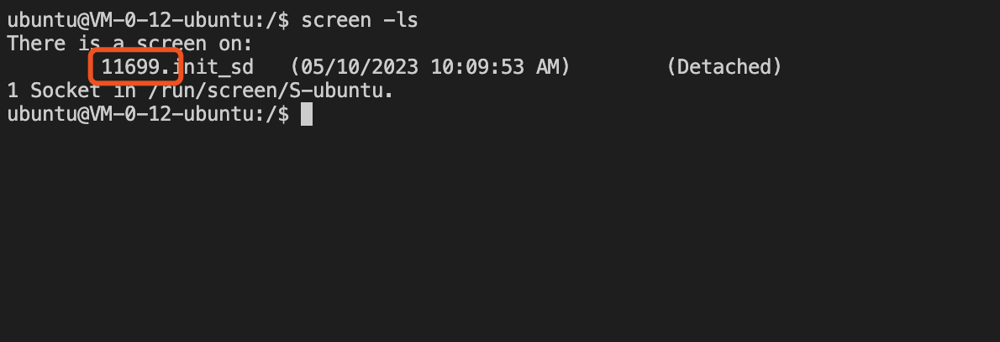

### 1、购买服务器
本教程选用的服务器是腾讯云GPU服务器GN7-T4价格会根据计算资源进行浮动
[腾讯云GPU服务器GN7-T4购买地址](https://cloud.tencent.com/act/pro/seckill_season?from=20385)


### 2、服务器配置选择

- 在使用StableDefussion的过程中我们会需要在[civitai.com](https://civitai.com/)上下载模型，模型的体积都比较大，为了保证下载速度一定要选择**海外**的机房，这里我选择的是**硅谷二区**
- 系统本教程选择的是 *Ubuntu Server 18.04.1*


### 3、登陆服务器

这里不做过多介绍默认大家已经学会了，不会操作的同学可以参考
- [腾讯云官方文档](https://cloud.tencent.com/document/product/213/16515)

- [使用VScode管理腾讯云服务器](/basic/使用VScode管理linux服务器.md)

### 4、开始搭建StableDefusion环境
1. 安装screen

```bash
#本文使用的服务器已经安装了screen 可以跳过本步骤
apt-get install screen
```

2. 创建一个screen会话 *(避免网络问题造成安装失败)*
```bash
screen -R init_sd 
```
3. 使用conda搭建python3环境

> 打开[conda官网](https://docs.conda.io/en/latest/miniconda.html)找到对应的Miniconda版本
这里使用的是 *Python 3.10 Miniconda3 Linux 64-bit*
```bash
#创建工作目录，避免文件乱放
mkdir ~/workspace
#进入工作目录
cd ~/workspace/
#下载Miniconda安装包
wget https://repo.anaconda.com/miniconda/Miniconda3-py310_23.3.1-0-Linux-x86_64.sh
#给安装脚本执行权限
chmod +x ./Miniconda3-py310_23.3.1-0-Linux-x86_64.sh 
#执行安装脚本
./Miniconda3-py310_23.3.1-0-Linux-x86_64.sh
```
执行安装脚本后你需要狂点 <kbd>回车</kbd> 阅读用户协议直到出现

然后输入 ‘yes’
等待安装完成（出现提示直接输入‘yes’就可以了）
```bash
#安装完成后推出当前的screen会话
exit
#重新建立一个screen会话
screen -R init_sd
#检查conda版本
conda -V
```
如果出现conda版本号则说明conda安装成功


4、安装StableDedussion-webUI
```bash
#创建一个python3.10.6的环境
conda create --name py3106 python=3.10.6
#拷贝一个环境命名为envSD
conda create -n envSD --clone py3106
#激活环境
conda activate envSD
```
出现(envSD) ubuntu 说明conda环境激活成功


```bash
#进入工作目录
cd ~/workspace/
#下载并执行安装脚本
bash <(wget -qO- https://raw.githubusercontent.com/AUTOMATIC1111/stable-diffusion-webui/master/webui.sh)
```
- 安装时间会比较长可以按 <kbd>control</kbd> + <kbd>a</kbd>+<kbd>d</kbd> 将安装进程放入后台执行
- 等待一段时间可以这样回复会话
```bash
screen -ls
```

```bash
#按照图中方式找到进程编号
screen -r 11699 #把11699 替换成你的进程编号
```
当出现 local URL 的时候说明StableDiffussion 安装成功

按 <kbd>control</kbd> + <kbd>c</kbd>
结束进程
```bash
#启动并允许公网访问
#进入工作目录
cd ~/workspace/stable-diffusion-webui/
./webui.sh --listen --enable-insecure-extension-access
```
更多启动选项请参考附件：[StableDefussion启动命令](./1.1_%E9%99%84%E4%BB%B6%E5%90%AF%E5%8A%A8%E5%8F%82%E6%95%B0%E8%AF%B4%E6%98%8E.md)
出现下图说明运行成功

打开浏览器输入url http://127.0.0.1:7860/
注意将 ‘127.0.0.1’ 替换成你的服务器的公网IP

你就可以在浏览器看到 StableDefussion的webUI界面了

### 5、总结
#### 搭建步骤
1. 购买服务器
2. 使用conda 创建python环境
3. 安装StableDefussion WebUI
4. 启动脚本允许公网访问
#### 成果
1. 我们完成了一个基本StableDifussion 工作环境的搭建
2. 我们的工作环境可以远程访问

#### 不足
1. 需要用IP地址去访问，这样很麻烦
2. 工作环境是英文的，我们需要汉化
3. webUI服务是启动在screen会话中，没有进程守护，一旦服务报错我们需要链接服务器重新启动webUI这样很不稳定
4. 工作环境完全在公网暴露，没有身份验证～～可能会被白嫖

### 6、下期预告
安装 StableDefussion 汉化包

