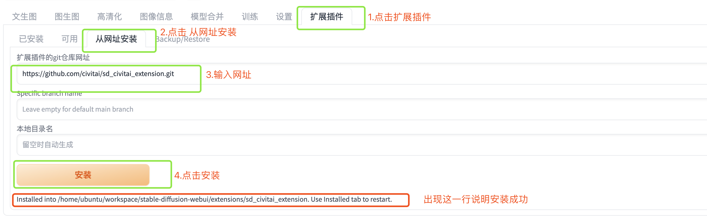
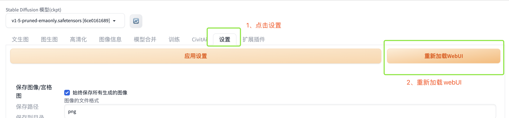
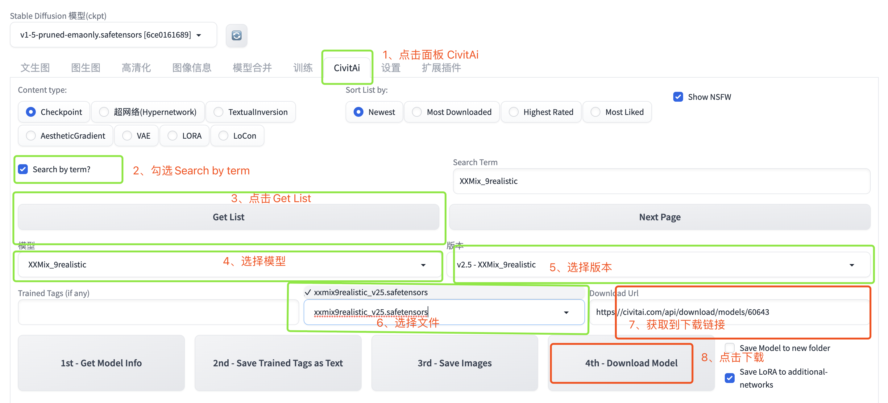
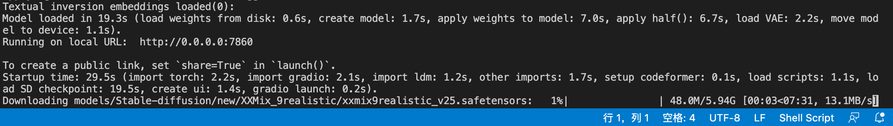
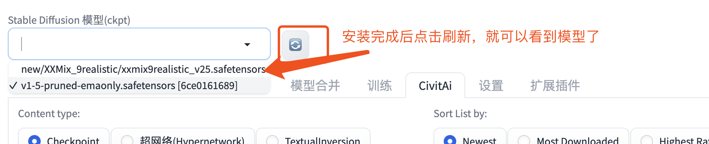

### 1、安装vicitai 插件
1. 点击选项卡 ‘扩展插件’
2. 点击 ‘从网址安装’
3. 输入 ‘扩展插件的git仓库网址’ 
   网址：`https://github.com/camenduru/sd-civitai-browser`

4. 重启webUI

### 2、安装civitai模型

1. 打开 [civitai 官网](https://civitai.com/)
2. 选择一个模型进入

3. 复制模型名称
4. 打开 WebUi点击面板‘CivitAi’
5. 填写模型信息（如下图）后点击安装

> 注意点击下载后页面是没有反应，需要耐心等待
> 如果打开后台我们会看到模型下载的进度条

6. 下载完成后刷新页面就可以看到最新安装的模型了

7. 测试模型
  

### 5、总结
#### 模型安装步骤
1. 安装CicitAi插件
2. 选择并下载CicitAi模型

