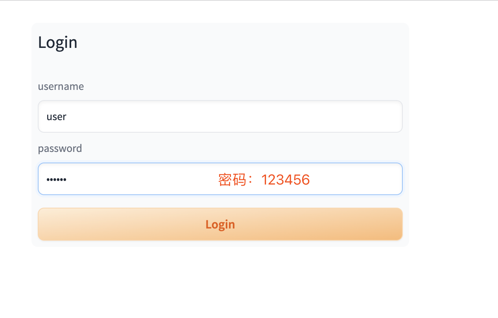
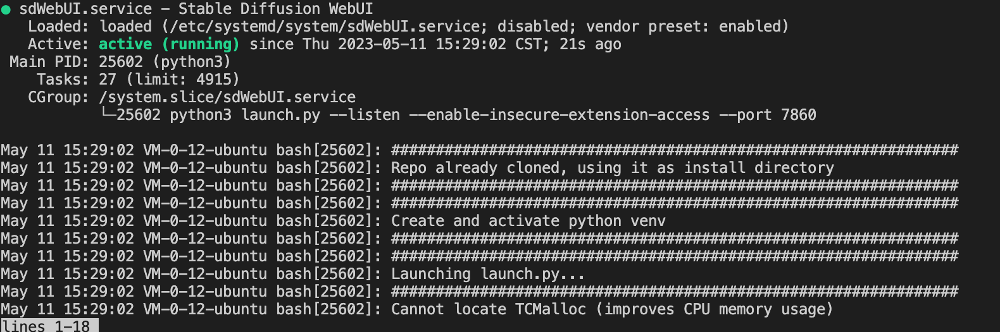
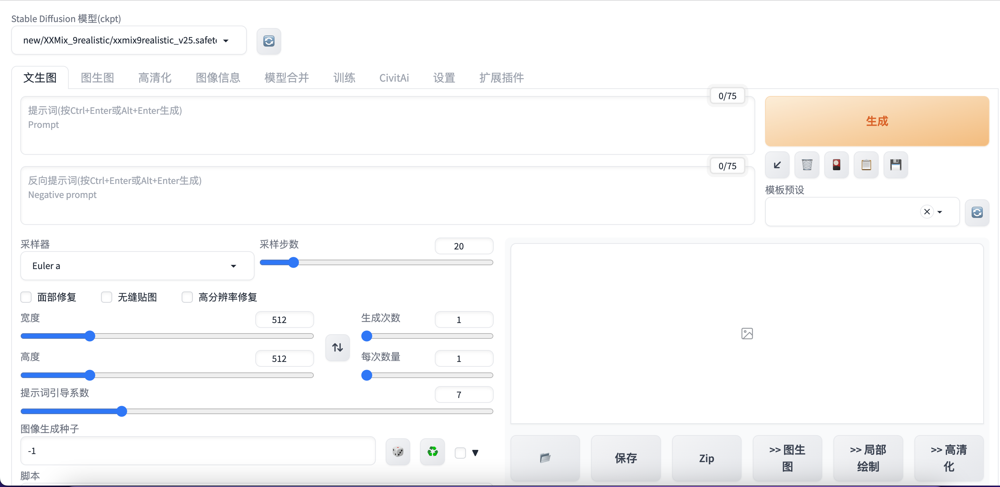
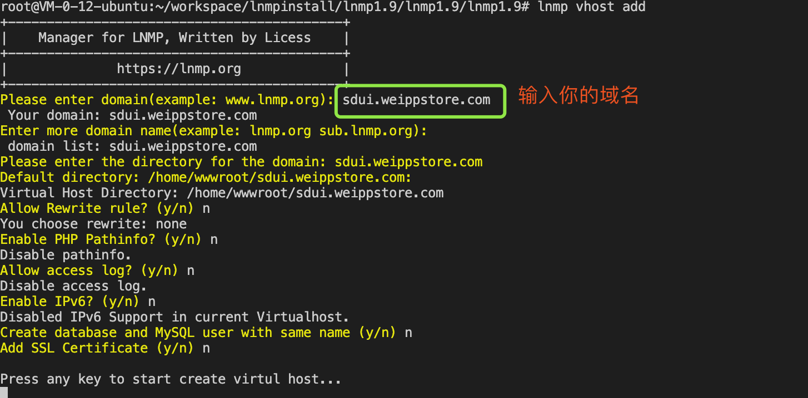
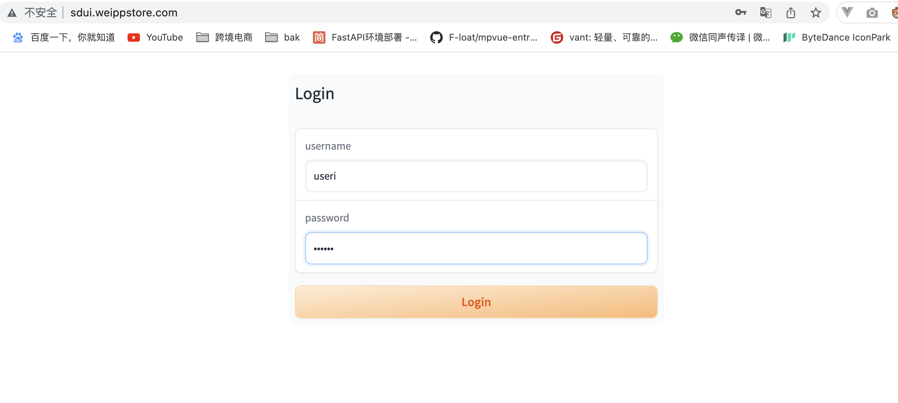

> 本教程是进阶教程，其实完成本教程的1-3节，你搭建的 StableDifussionWebUI就已经可以满足学习和个人工作使用了。完全可以跳过本教程继续学习有面的课程。
> #### 本教程适合以下人群使用
> 1. 就是喜欢折腾，追求完美
> 2. 搭建的StableDifussionWeb UI 会共享个很多人使用例如：
> - 自媒体工作室 
> - 淘宝商家
> - 设计公司
### 1、使用密码
> 细心的朋友可能会发现，之前的教程中我们的WebUI一旦使用--listen这个启动参数后，在任何一台设备上都可以使用，这就相当于我家大门常打开，谁都能白嫖！现在我们修改我们的启动命令增加密码验证

```bash
cd /home/ubuntu/workspace/stable-diffusion-webui
conda activate envSD
./webui.sh --listen --enable-insecure-extension-access --gradio-auth user:123456
```
打开webui页面我们发现出现了登陆框

如果有很多用户和密码可以这样配置
```bash
#进入workspace目录
cd ~/workspace
#创建 StableDifussionWebUser.txt
vim StableDifussionWebUser.txt
#按i写入配置文件
```
> 账号密码格式说明
> {用户名1}:{密码1},
> {用户名2}:{密码2},
```StableDifussionWebUser.txt
user1:123456,
user2:456789,
```
再次启动WebUI
```bash
cd /home/ubuntu/workspace/stable-diffusion-webui
conda activate envSD
./webui.sh --listen --enable-insecure-extension-access --gradio-auth-path "/home/ubuntu/workspace/StableDifussionWebUser.txt"
```
打开webui页面我们发现出现了登陆框

使用user2登陆成功
### 2、使用sysctl启动项目

> 之前我们使用screen保留会会话使StableDifussionWebUI在后台运行这样做会有两个问题
> 1. 每次启动的时候都需要输入一些启动参数很麻烦
> 2. screen 虽然可以保存会话但是WebUI一旦报错（小概率事件）我们还是需要登陆服务器再次启动StableDifussionWebUI
> 因此本教程我们使用systemd来管理、守护进程

```bash
#进入system文件夹
cd /etc/systemd/system
#直接切换成root用户
sudo -s
#创建sdWebUI.service 文件
vim sdWebUI.service
#按i写入配置文件
```

```sdWebUI.service
[Unit]
Description=Stable Diffusion WebUI
After=network.target

[Service]
Environment="PATH=/home/ubuntu/miniconda3/bin:/usr/local/sbin:/usr/local/bin:/usr/sbin:/usr/bin:/sbin:/bin"
ExecStart=/bin/bash -lc 'source /home/ubuntu/miniconda3/bin/activate envSD && /home/ubuntu/workspace/stable-diffusion-webui/webui.sh --listen --enable-insecure-extension-access --port 7860 --gradio-auth-path "/home/ubuntu/workspace/StableDifussionWebUser.txt"'
WorkingDirectory=/home/ubuntu/workspace/stable-diffusion-webui
User=ubuntu
Group=ubuntu
Restart=always

[Install]
WantedBy=multi-user.target
```
按 <kbd>ESC</kbd> 然后按 <kbd>:</kbd> 输入 `wq!` 按 <kbd>回车</kbd> 这样stable-web-ui.service 文件就创建好了

```bash

#重新加载systemctl
systemctl daemon-reload
#启动webui
systemctl start sdWebUI.service 
#检查启动状态
systemctl status sdWebUI.service 
#停止webUI【现在不用】
systemctl stop sdWebUI.service 
```
检查状态出现下图说明服务启动成功

打开浏览器输入 http://[服务器IP]:7860,熟悉的页面又出现了！！现在终于告别screen了


### 3、绑定域名
> 到目前为止我们的 WebUI已经像样多了，但是还有一个很麻烦的问题就是我们每次使用webUI都需要输入一长串的ip地址以及一个端口号。这样的使用体验相当不好。现在我们就开始给我们的WebUI增加域名吧！开始前我已经解析了一个域名 sdui.weippstore.com 到我的服务器了。

- 如果你有域名的话，可以接些到服务器，服务器是国外的话域名不用备案(域名如何解析，请参考服务商的文档)
- 没有的话也不要紧，可以通过修改机的 hosts文件进行学习（修改hosts文件这里不做展开，可以参考这篇文章）[如何在Linux、Windows和macOS修改hosts文件](https://www.myfreax.com/how-to-edit-your-hosts-file/)

1. 安装LNMP 一件包
   
```bash
#开启一个screen会话
screen -R lnmp
#进入workspace
cd ~/workspace/
#创建一个下载目录方便安装完成后删掉安装包
mkdir lnmpinstall
#进入目录
cd ./lnmpinstall/
#切换到root用户
sudo -s
#下载并安装
wget http://soft.vpser.net/lnmp/lnmp1.9.tar.gz -cO lnmp1.9.tar.gz && tar zxf lnmp1.9.tar.gz && cd lnmp1.9 && ./install.sh lnmp
```
> 安装过程中需要选择mysql版本，设置密码。因为mysql，php等都用不到所以选择默认就可以了。能不安装的就不要安装了。
> 等待亿小会lnmp 就安装成功了

```bash
#检查lnmp 版本
lnmp -V
#添加vhost
lnmp vhost add
```

修改vhost设置反向代理

```bash
cd /usr/local/nginx/conf/vhost/
vim sdui.weippstore.com.conf #将sdui.weippstore.com.conf替换成你的域名
```
修改后的vhost文件
```sdui.weippstore.com.conf

server
    {
        listen 80;
        #listen [::]:80;
        server_name sdui.weippstore.com ;
        index index.html index.htm index.php default.html default.htm default.php;
        root  /home/wwwroot/sdui.weippstore.com;

        include rewrite/none.conf;
        #error_page   404   /404.html;

        # Deny access to PHP files in specific directory
        #location ~ /(wp-content|uploads|wp-includes|images)/.*\.php$ { deny all; }

        # include enable-php.conf;

        # location ~ .*\.(gif|jpg|jpeg|png|bmp|swf)$
        # {
        #     expires      30d;
        # }

        # location ~ .*\.(js|css)?$
        # {
        #     expires      12h;
        # }

        # location ~ /.well-known {
        #     allow all;
        # }

        # location ~ /\.
        # {
        #     deny all;
        # }
        location / {
            proxy_set_header Upgrade $http_upgrade; #这是webSocket的配置
            proxy_set_header Connection "Upgrade"; #这是webSocket的配置
            proxy_http_version 1.1; #这两个最好也设置
            proxy_set_header x-Real-IP $remote_addr;
            proxy_set_header X-Forwarded-For $proxy_add_x_forwarded_for;
            proxy_set_header Host $http_host;
            proxy_pass http://127.0.0.1:7860/; # 这里是stable difussion webui 的地址
        }
        access_log off;
    }
```

```bash
#修改完成后重启nginx
sudo nginx -s reload
```
> 现在我们使用nginx来转发请求，所以启动 WebUI 的时候不再需要监听公网我们修改sdWebUI.service 文件

```bash
#进入system文件夹
cd /etc/systemd/system
#直接切换成root用户
sudo -s
#创建sdWebUI.service 文件
vim sdWebUI.service
#按i编辑配置文件 将启动命令中的--listen去掉
```
修改后的 sdWebUI.service 文件如下
```sdWebUI.service
[Unit]
Description=Stable Diffusion WebUI
After=network.target

[Service]
Environment="PATH=/home/ubuntu/miniconda3/bin:/usr/local/sbin:/usr/local/bin:/usr/sbin:/usr/bin:/sbin:/bin"
ExecStart=/bin/bash -lc 'source /home/ubuntu/miniconda3/bin/activate envSD && /home/ubuntu/workspace/stable-diffusion-webui/webui.sh --enable-insecure-extension-access --port 7860 --gradio-auth-path "/home/ubuntu/workspace/StableDifussionWebUser.txt"'
WorkingDirectory=/home/ubuntu/workspace/stable-diffusion-webui
User=ubuntu
Group=ubuntu
Restart=always

[Install]
WantedBy=multi-user.target

```

```bash
#重新加载systemctl
systemctl daemon-reload
#启动webui
systemctl start sdWebUI.service 
#检查启动状态
systemctl status sdWebUI.service 
```
在浏览器输入url https://sdui.weippstore.com 成功打卡webUI



### 总结
#### 成果
现在我们成功的在Ubuntu 上搭建StableDifussionWebUI我们实现了

- WebUI 的搭建
- 插件的安装
- WebUI 设置密码
- 给WebUI增加进程守护
- 使用域名打开 WebUI
  
#### 不足

下面是大家可能会问到的几个问题，我先写在这里

Q1:为什么一定要用海外的服务器

答：StableDifussion运行的过程中会需要从github上下载很的包，虽然有国内景象，但是配置起来还是需要一点功夫的，不如直接用海外服务器来的简单。同时经过实际测试，国内服务器下载模型的时候真的很让人抓狂。

Q2:这个环境的搭建为什么没有考虑启用多个进程，多用户同时访问怎么办？
答：算力有限，等我有钱买100块A100的时候再去思考这个问题。现在我不配～_～!!

Q3:为啥不用windows 服务器
答：不喜欢(￣ε(#￣)☆╰╮o(￣皿￣///) 


