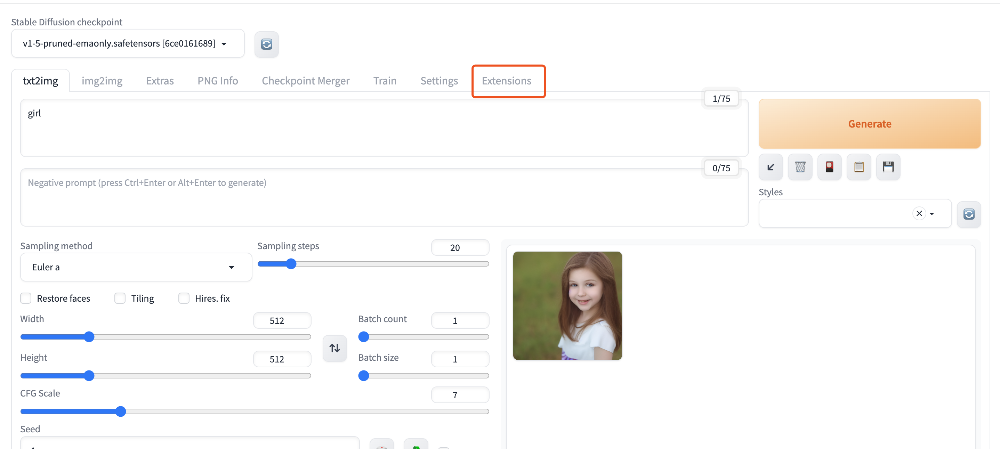
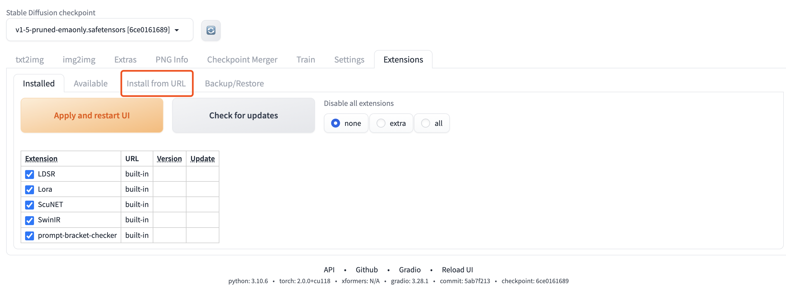
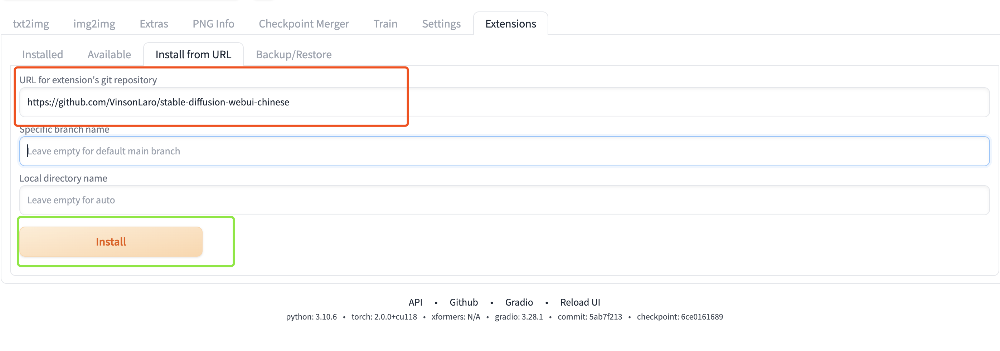
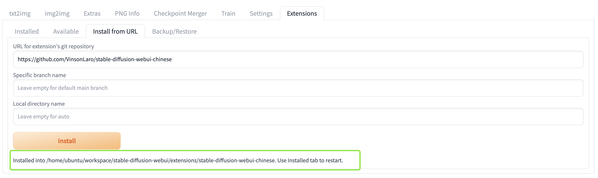
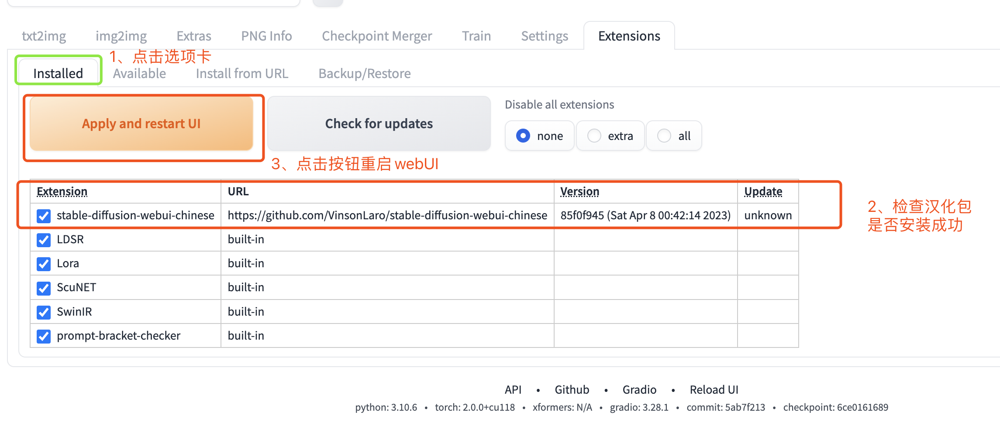
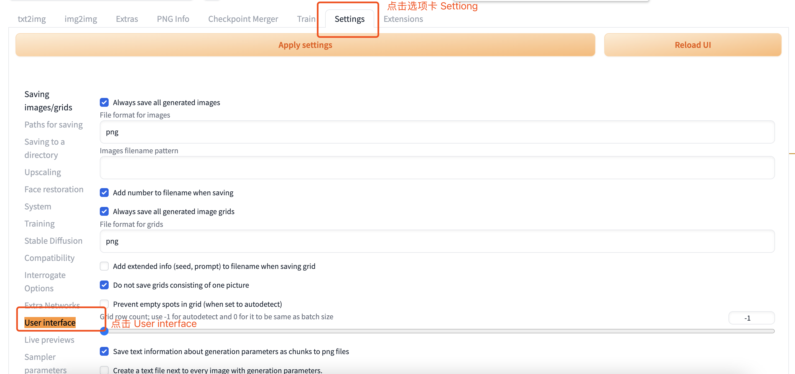
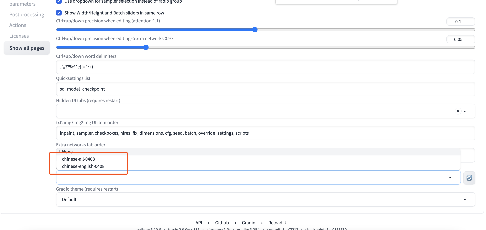
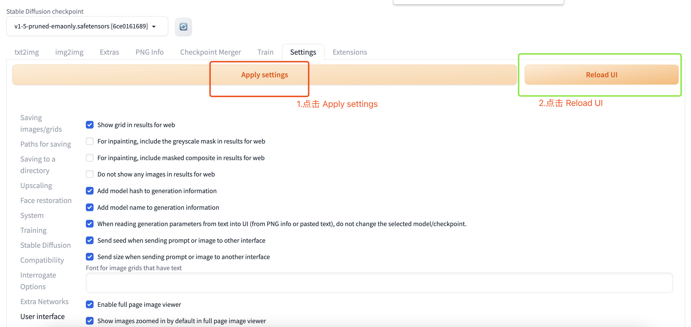
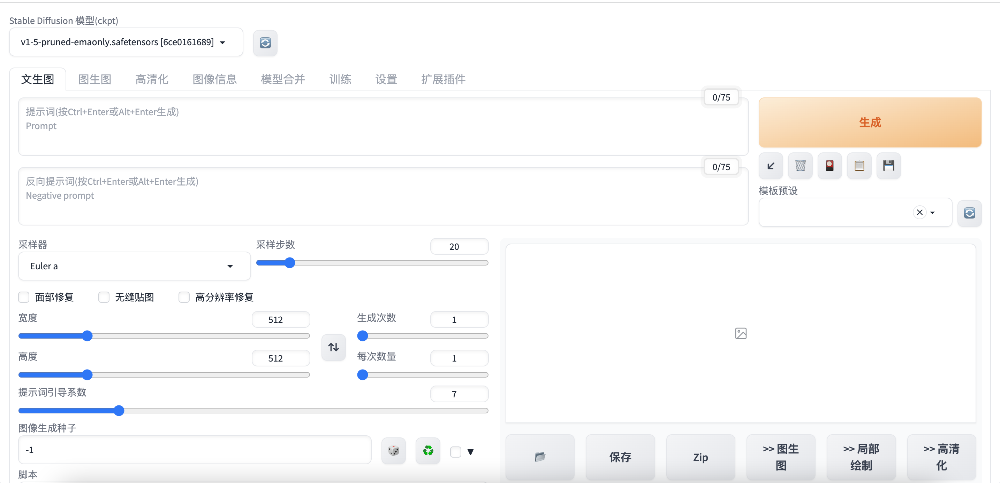

### 1、StableDefussion 汉化包地址

https://github.com/VinsonLaro/stable-diffusion-webui-chinese

### 2、启动StableDefussion WebUI
```bash
#链接服务器之后开启一个screen
screen -R sd_serve
#进入工作目录
cd ~/workspace/stable-diffusion-webui
#输入命令
./webui.sh --listen --enable-insecure-extension-access
```
注意一定要使用参数 **--enable-insecure-extension-access**
不然会造汉化包没有安装权限

### 3、打开StableDefussion WebUI 完成汉化

1. 点击 Extensions 卡片


2. 点击 Install from URL 卡片


3. 输入汉化包地址并点击安装



4. 出现下面一行文字说明安装成功



5. 重启webUI



6. 加载中文汉化包

在界面里最下方的"Localization (requires restart)"，选择"Chinese-All"或者"Chinese-English"

点击界面最上方的黄色按钮"Apply settings"，再点击右侧的"Reload UI"即可完成汉化


7. 汉化成功


### 4、总结
#### 汉化步骤
1. 启动webUI界面
2. 将地址 `https://github.com/VinsonLaro/stable-diffusion-webui-chinese` 复制到Install from
3. 重启 WebUi
4. 设置语言为汉语
5. 重启 WebUi
6. 汉化成功

### 下期预告
安装模型