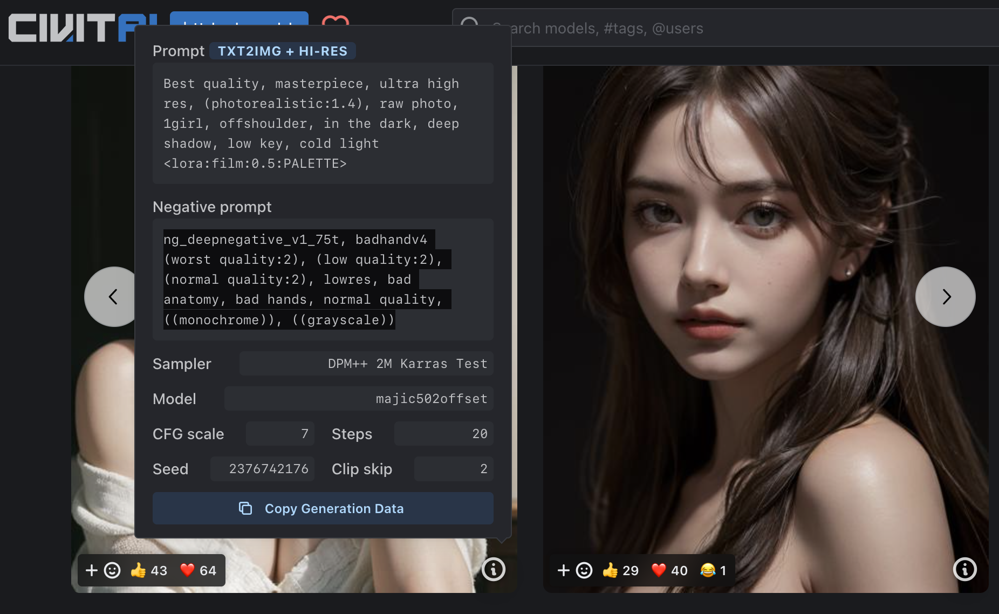

### Stable Diffussion 工作原理-checkpoint，LORA，Embedding 

#### 废话写在前面
> 如果我们把学习 stable diffussion 比做修炼一门上乘武功的话，那么了解其工作原理就是修炼这门武功的重中之重。看过笑傲江湖的朋友肯定知道。同样是练习林家的《辟邪剑谱》，林平之的祖父林远图就能在江湖上，打遍天下无敌手，镇慑群小。而到了林平之父亲这一代就只能是，江湖不是打打杀杀，而是人情世故了。我们站在上帝视角很容易就明白，其实林平之和他父亲林震南练习的《辟邪剑谱》只是少了一句话，知道的小伙伴可以把这句话打在弹幕里...
> 好了，回归正题。如果你已经学习了很多关于，Stable Diffussion或者 Midjourney 的教程，记了很多提示词，或者奇奇怪怪的绘图方法的话。那么恭喜你，你已经学会了《辟邪剑谱》99%的内容，只需要完成第一步，就可以发挥出他的威力了。如果没有，那么更要恭喜你，你会发现在你了解了Stable Diffussion 的工作原理后，这些东西根本不用记....
#### 从一行报错开始

1. 打开一个screen 窗口，在窗口中启动Stable Difussion Web UI
```bash
#打开窗口
screen -r SdWebUI
#进入工作目录
cd ~/workspace/stable-diffusion-webui/
./webui.sh --listen --enable-insecure-extension-access
```
2. 在 civitai [一张图片的提示词](https://civitai.com/models/43331/majicmix-realistic),将提示词复制到，WebUI 的文生图中。点击生成


3. 回到命令行，查看StableDiffussion 后台我们会发现有这样一段报错
> Model loaded in 12.6s (load weights from disk: 0.7s, create model: 1.2s, apply weights to model: 5.2s, apply half(): 4.8s, move model to device: 0.7s).
Couldn't find Lora with name film

翻译成中文的意思是，<font color="red">找不到名为“film”的Lora。</font>

> 模型加载需要12.6秒（从磁盘加载权重：0.7秒，创建模型：1.2秒，将权重应用于模型：5.2秒，应用 half()：4.8秒，将模型移动到设备：0.7秒）。<font color="red">找不到名为“film”的Lora。</font>


